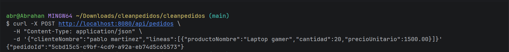
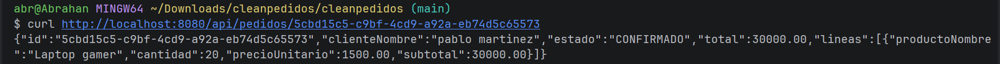
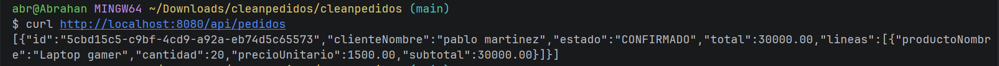

# Sistema de Pedidos con Clean Architecture

Implementación de un módulo de gestión de pedidos aplicando **Clean Architecture** con sus cuatro círculos concéntricos, desarrollado con Java 17 y Spring Boot 3.x.

---

## Arquitectura

```
┌─────────────────────────────────────────────┐
│        Frameworks & Drivers                 │
│  (Spring Boot, JPA, H2, Controllers)        │
│  ┌───────────────────────────────────────┐  │
│  │       Interface Adapters              │  │
│  │  (PedidoController, DTOs, Adapter)    │  │
│  │  ┌─────────────────────────────────┐  │  │
│  │  │         Use Cases               │  │  │
│  │  │  (CrearPedido, ConsultarPedido, │  │  │
│  │  │   PedidoRepositoryPort)         │  │  │
│  │  │  ┌───────────────────────────┐  │  │  │
│  │  │  │        Entities           │  │  │  │
│  │  │  │  (Pedido, LineaPedido,    │  │  │  │
│  │  │  │   Dinero, PedidoId)       │  │  │  │
│  │  │  └───────────────────────────┘  │  │  │
│  │  └─────────────────────────────────┘  │  │
│  └───────────────────────────────────────┘  │
└─────────────────────────────────────────────┘
```

### Regla de dependencia

El código **solo apunta hacia adentro**: los círculos externos dependen de los internos, nunca al revés. El paquete `domain/` no contiene ningún import de Spring ni JPA.

---

## Estructura de Paquetes

```
com.example.cleanpedidos/
├── domain/
│   ├── entity/
│   │   └── Pedido.java                  ← Aggregate Root
│   └── valueobject/
│       ├── PedidoId.java
│       ├── LineaPedido.java
│       ├── Dinero.java
│       └── EstadoPedido.java
├── usecase/
│   ├── CrearPedidoUseCase.java
│   ├── ConsultarPedidoUseCase.java
│   ├── port/
│   │   └── PedidoRepositoryPort.java
│   └── impl/
│       ├── CrearPedidoService.java
│       └── ConsultarPedidoService.java
├── adapter/
│   ├── in/web/
│   │   ├── PedidoController.java
│   │   └── dto/
│   │       ├── CrearPedidoRequest.java
│   │       └── PedidoResponse.java
│   └── out/persistence/
│       ├── PedidoJpaEntity.java
│       ├── PedidoJpaRepository.java
│       └── PedidoRepositoryAdapter.java
├── config/
│   └── PedidoConfiguration.java
└── CleanPedidosApplication.java
```

---

## Tecnologías

| Tecnología | Versión |
|---|---|
| Java | 17 |
| Spring Boot | 3.x |
| Spring Data JPA | — |
| Base de datos | H2 (en memoria) |
| Build tool | Maven 3.8+ |

---

## Cómo ejecutar

**1. Clonar el repositorio**

```bash
git clone https://github.com/Abrahan07/Patrones-Remolina-post1-u8.git
cd Patrones-Remolina-post1-u8
```

**2. Compilar**

```bash
mvn clean compile
```

**3. Ejecutar**

```bash
mvn spring-boot:run
```

La aplicación queda disponible en `http://localhost:8080`.

---

## Endpoints disponibles

| Método | URL | Descripción |
|---|---|---|
| POST | `/api/pedidos` | Crear un nuevo pedido |
| GET | `/api/pedidos/{id}` | Consultar pedido por ID |
| GET | `/api/pedidos` | Listar todos los pedidos |

---

## Pruebas con curl

**Crear un pedido**

```bash
curl -X POST http://localhost:8080/api/pedidos \
  -H "Content-Type: application/json" \
  -d '{
    "clienteNombre": "Ana García",
    "lineas": [
      {
        "productoNombre": "Laptop",
        "cantidad": 1,
        "precioUnitario": 1500.00
      }
    ]
  }'
```

**Respuesta esperada (201 Created)**

```json
{
  "pedidoId": "xxxxxxxx-xxxx-xxxx-xxxx-xxxxxxxxxxxx"
}
```

**Consultar un pedido**

```bash
curl http://localhost:8080/api/pedidos/{pedidoId}
```

**Listar todos los pedidos**

```bash
curl http://localhost:8080/api/pedidos
```

---

## Capturas de pantalla

### POST - Crear pedido



### GET - Consultar pedido por ID



### GET - Listar todos los pedidos



---
